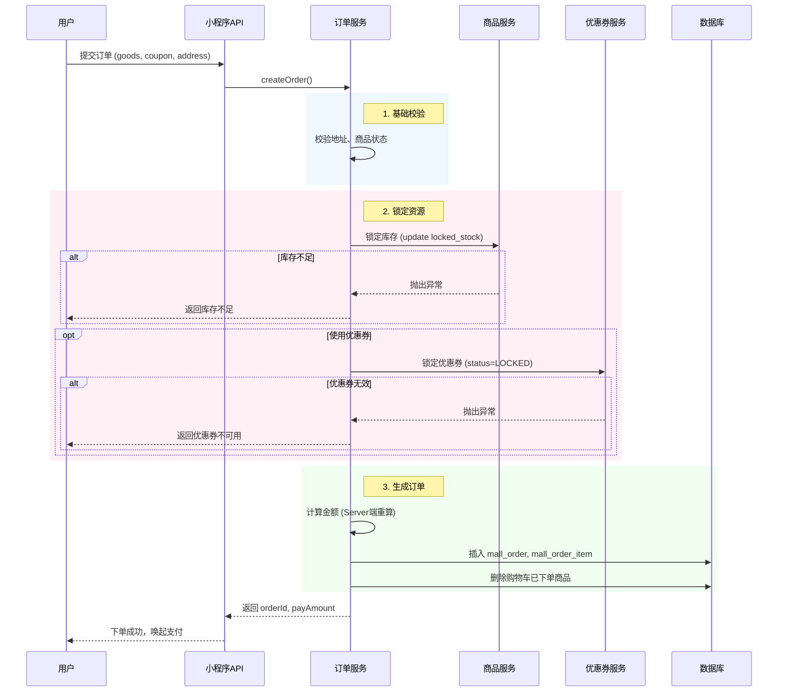
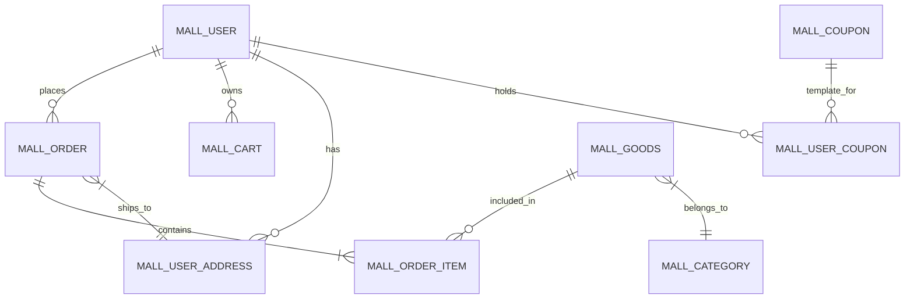

# 系统设计说明书 (System Design Document)

## 1. 系统架构设计

### 1.1 总体架构
本系统采用前后端分离架构，基于 **Spring Boot** 进行后端开发，前端分别采用 **uni-app**（小程序）和 **Vue 3**（管理后台）。系统设计遵循模块化、高内聚低耦合原则。

#### 架构图 (Mermaid)
```mermaid
graph TD
    User[用户 (C端)] -->|微信小程序| MP[uni-app 小程序]
    Admin[管理员 (B端)] -->|Web 浏览器| AdminWeb[Vue3 管理后台]
    
    subgraph AccessLayer [接入层]
        Nginx[Nginx / 网关]
    end
    
    MP --> Nginx
    AdminWeb --> Nginx
    
    subgraph AppLayer [应用层 (Spring Boot)]
        API[Mall Server]
        Auth[认证模块]
        Order[订单模块]
        Product[商品模块]
        UserMod[用户模块]
    end
    
    Nginx --> API
    
    subgraph DataLayer [数据层]
        MySQL[MySQL 8.0]
        Redis[Redis (可选/缓存)]
    end
    
    API --> MySQL
    API -.-> Redis
```

#### 架构图 (文本版)
```text
+-----------------+       +--------------------+
|   用户 (C端)    | ----> | uni-app 小程序     | --+
+-----------------+       +--------------------+   |
                                                   v
                                          +----------------+
                                          |   Nginx 网关   |
                                          +----------------+
                                                   |
                                                   v
+-----------------+       +--------------------+   |
|  管理员 (B端)   | ----> | Vue3 管理后台      | --+
+-----------------+       +--------------------+   |
                                                   |
             +-------------------------------------+
             |
             v
+-----------------------------------------------------------+
|                  应用层 (Spring Boot)                     |
|                                                           |
|   [认证模块]   [订单模块]   [商品模块]   [用户模块]       |
+-----------------------------------------------------------+
             |                     :
             v                     v
    +----------------+     +----------------+
    |    MySQL 8.0   |     |      Redis     |
    +----------------+     +----------------+
```

### 1.2 模块划分 (`mall-server-backend`)
项目采用 Maven 多模块构建：
- **mall-server-parent**: 父工程，管理依赖版本。
- **mall-server**: 启动模块，包含 Application 入口和配置。
- **mall-web**: Web 层，包含 Controller、Filter、GlobalExceptionHandler。
- **mall-service**: 业务逻辑层，包含 Service 接口与实现、DTO/VO 定义。
- **mall-core**: 核心工具层，包含 Utils、Constants、Enums。
- **mall-persistence**: 持久层，包含 Entity、Mapper (MyBatis-Plus)。

---

## 2. 核心功能实现细节

### 2.1 认证与授权 (Authentication & Authorization)

#### 2.1.1 管理后台 (Admin)
- **机制**: JWT (JSON Web Token)
- **流程**:
    1.  用户输入账号密码。
    2.  `AdminAuthController.login` 接收请求，调用 `AdminAuthService` 验证密码 (BCrypt)。
    3.  验证通过后，生成 `access_token` (JWT) 和 `refresh_token`。
    4.  后续请求在 Header 中携带 `Authorization: Bearer <token>`。
    5.  `AdminAuthInterceptor` 拦截请求，解析 JWT，校验有效性及权限。
- **关键类**: `AdminAuthController`, `AdminAuthService`, `JwtUtil`, `AdminAuthInterceptor`.

#### 2.1.2 小程序端 (Mini-program)
- **机制**: 微信 `code2Session` + 自定义 Token
- **流程**:
    1.  小程序端调用 `wx.login()` 获取 `code`。
    2.  调用后端 `/mall/mini/login` 接口，传输 `code`。
    3.  后端调用微信 API 获取 `openid` 和 `session_key`。
    4.  若用户不存在，自动注册；若存在，更新最后登录时间。
    5.  生成自定义 Token (UUID)，存入 `mall_user` 表或 Redis (当前实现存表)，并返回给小程序。
    6.  后续请求在 Header 中携带 `X-User-Id` 和 `X-Token`。
    7.  `MiniAuthInterceptor` 拦截请求，校验 Token 是否匹配且未过期。
- **关键类**: `MiniMallController`, `MiniAuthService`, `MiniAuthInterceptor`.

### 2.2 商品管理 (Product Management)

- **数据模型**:
    - `mall_category`: 分类表，支持多级（目前实现为一级）。
    - `mall_goods`: 商品表，包含 `price` (现价), `original_price` (原价), `stock` (库存), `locked_stock` (锁定库存)。
- **库存扣减策略**:
    - **下单预占 (Lock)**: 用户下单时，增加 `locked_stock`。
        ```sql
        UPDATE mall_goods SET locked_stock = locked_stock + #{qty} 
        WHERE id = #{id} AND stock - locked_stock >= #{qty}
        ```
    - **支付实扣 (Deduct)**: 支付成功后，扣减 `stock` 和 `locked_stock`。
        ```sql
        UPDATE mall_goods SET stock = stock - #{qty}, locked_stock = locked_stock - #{qty}
        WHERE id = #{id}
        ```
    - **超时释放 (Release)**: 订单超时未支付，减少 `locked_stock`。

### 2.3 购物车 (Shopping Cart)

- **逻辑**:
    - **添加**: 查询 `mall_cart` 是否存在 `user_id` + `goods_id` 的记录。若存在，更新 `quantity`；若不存在，插入新记录。
    - **合并**: 当前版本未实现未登录购物车合并，强制要求登录。
    - **清空**: 下单成功后，根据勾选状态 (`checked=1`) 物理删除购物车记录。

### 2.4 订单处理 (Order Processing)

#### 2.4.1 订单创建流程


#### 2.4.2 支付回调与状态流转
- **支付方式**: 当前为模拟支付，前端调用 `/mall/mini/pay/notify` 模拟回调。
- **状态机**:
    - `PENDING_PAY` (待支付) -> `PENDING_SHIP` (待发货): 支付成功。
    - `PENDING_PAY` -> `CANCELLED` (已取消): 超时未付或用户取消。
    - `PENDING_SHIP` -> `SHIPPED` (配送中): 管理员发货。
    - `SHIPPED` -> `COMPLETED` (已完成): 用户确认收货。
    - `SHIPPED` -> `REFUNDING` (售后中) -> `REFUNDED` (已退款): 售后流程。

### 2.5 营销系统 (Marketing)

- **优惠券 (Coupon)**:
    - **领取**: 用户领取时，插入 `mall_user_coupon`，状态 `UNUSED`。
    - **使用**: 下单时校验 `min_amount` 和有效期，状态变更为 `LOCKED`。
    - **核销**: 支付成功后，状态变更为 `USED`。
    - **回滚**: 订单取消或全额退款后，状态回滚为 `UNUSED`。

---

## 3. 数据库设计详解

### 3.1 实体关系图 (ERD)



### 3.2 关键表结构

#### 3.2.1 订单表 (`mall_order`)
| 字段名 | 类型 | 描述 | 索引 |
| :--- | :--- | :--- | :--- |
| `id` | BIGINT | 主键 | PRIMARY |
| `order_no` | VARCHAR(64) | 订单号 (唯一) | UNIQUE |
| `user_id` | BIGINT | 用户ID | IDX |
| `status` | VARCHAR(32) | 状态 | IDX |
| `total_amount` | DECIMAL | 商品总金额 | |
| `pay_amount` | DECIMAL | 实付金额 | |
| `pay_deadline` | DATETIME | 支付截止时间 | IDX |
| `create_time` | DATETIME | 下单时间 | |

#### 3.2.2 商品表 (`mall_goods`)
| 字段名 | 类型 | 描述 | 关键逻辑 |
| :--- | :--- | :--- | :--- |
| `id` | BIGINT | 主键 | |
| `stock` | INT | 实际库存 | 支付后扣减 |
| `locked_stock` | INT | 锁定库存 | 下单增加，支付/取消减少 |
| `status` | TINYINT | 上架状态 | 1:上架 0:下架 |

---

## 4. 接口 API 设计

### 4.1 管理后台接口 (`/mall/admin/**`)

| 方法 | 路径 | 描述 | 参数 |
| :--- | :--- | :--- | :--- |
| POST | `/auth/login` | 管理员登录 | `username`, `password` |
| GET | `/goods/page` | 商品分页查询 | `page`, `limit`, `name`, `categoryId` |
| POST | `/goods/save` | 新增/修改商品 | `GoodsDTO` |
| POST | `/upload/image` | 图片上传 | `file` |
| POST | `/order/ship` | 订单发货 | `orderId`, `expressCompany`, `expressNo` |

### 4.2 小程序接口 (`/mall/mini/**`)

| 方法 | 路径 | 描述 | 参数 |
| :--- | :--- | :--- | :--- |
| POST | `/auth/login` | 微信登录 | `code`, `userInfo` |
| GET | `/home/index` | 首页聚合数据 | - |
| POST | `/cart/add` | 添加购物车 | `goodsId`, `quantity` |
| POST | `/order/create` | 创建订单 | `addressId`, `couponId`, `goodsList` |
| POST | `/pay/notify` | 模拟支付回调 | `orderId`, `result` |

---

## 5. 部署与运维

### 5.1 环境要求
- **JDK**: OpenJDK 17
- **MySQL**: 8.0+
- **Nginx**: 1.18+

### 5.2 定时任务
系统内置了定时任务 (`MiniOrderCloseJob`)，每分钟执行一次：
- **功能**: 扫描 `mall_order` 表中状态为 `PENDING_PAY` 且 `pay_deadline < NOW()` 的订单。
- **操作**: 自动取消订单，释放库存和优惠券。

### 5.3 日志与监控
- **应用日志**: 输出至控制台及文件 (`logs/mall-server.log`)。
- **支付日志**: 记录在 `mall_pay_log` 表中，用于对账。
